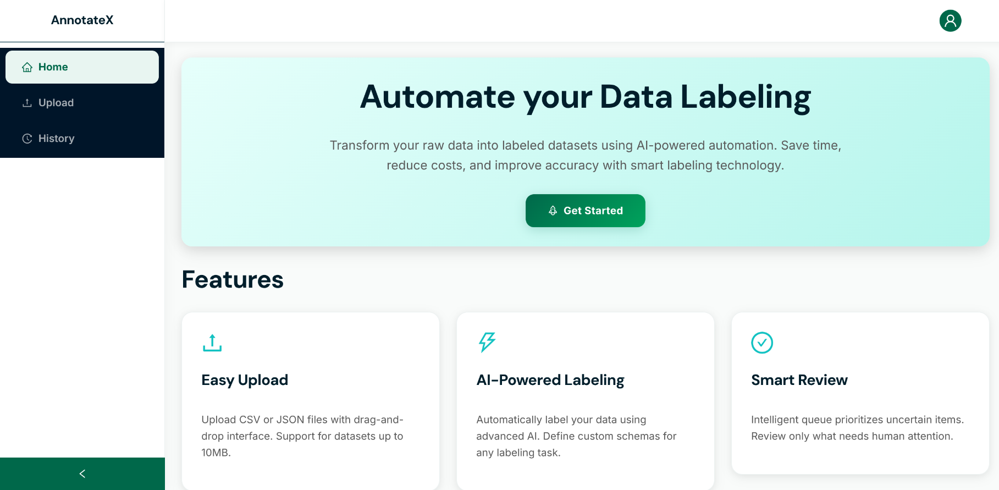
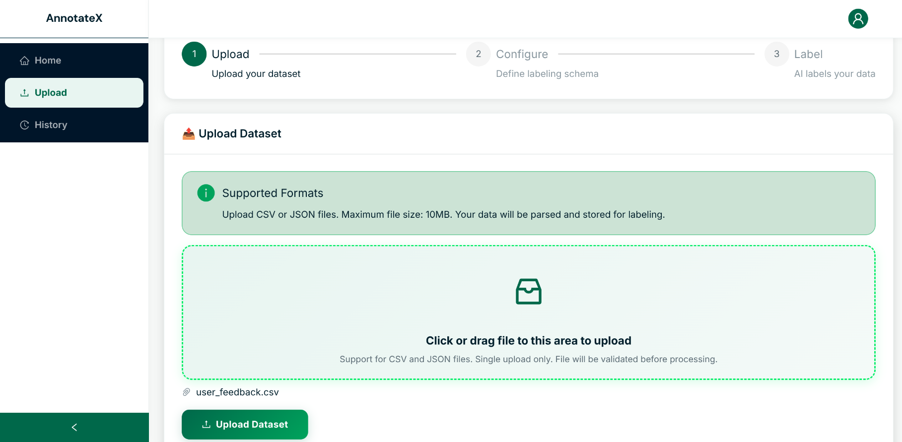
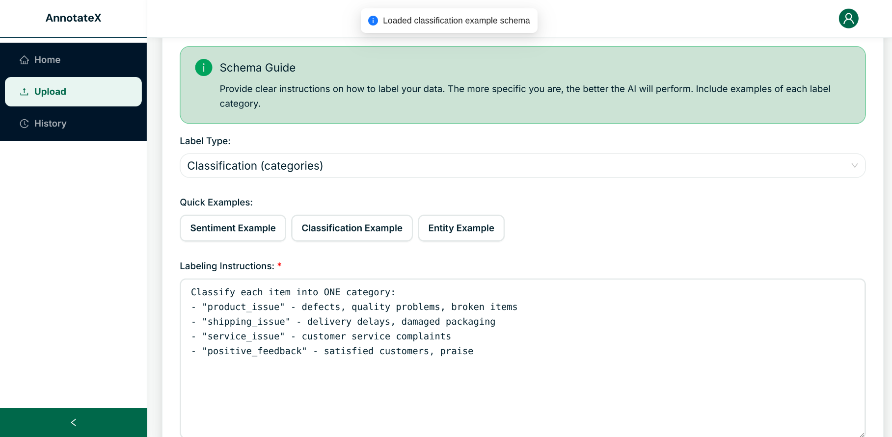
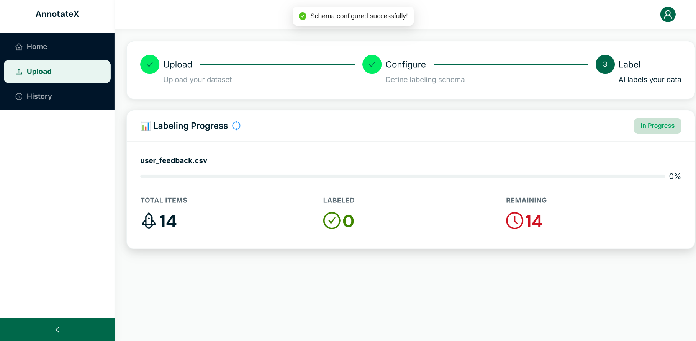
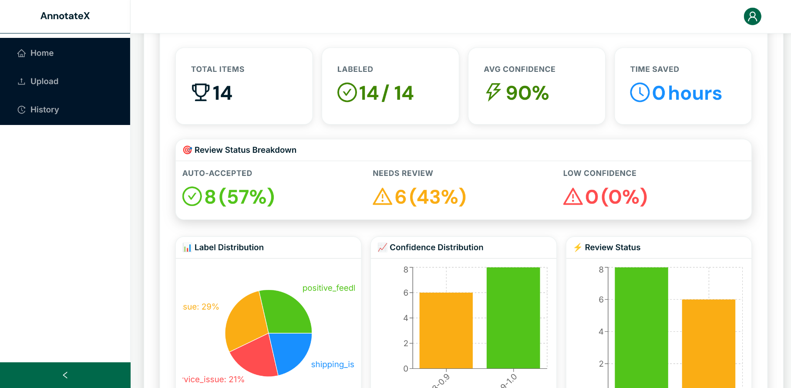
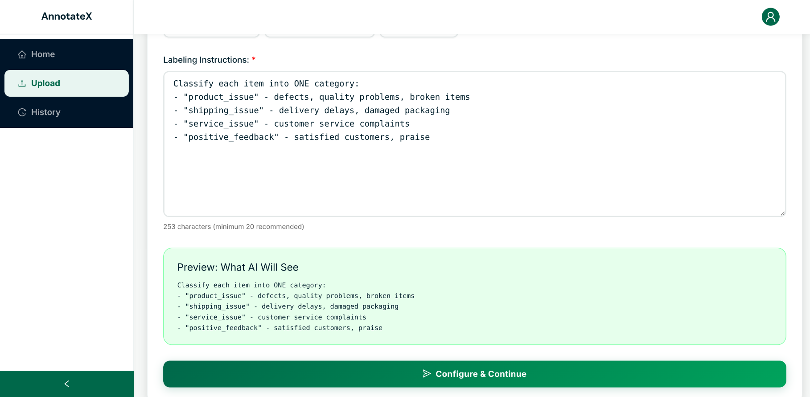
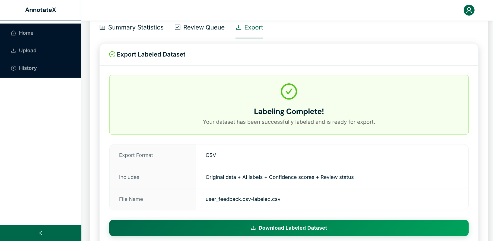
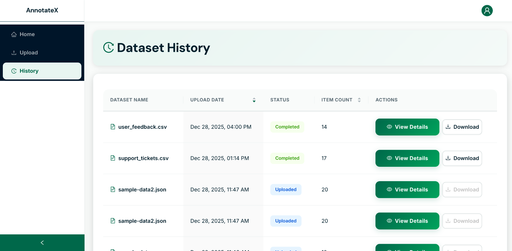

<div align="center">

# 🚀 Automated Data Labeling Dashboard

### **AI-Powered Dataset Labeling • Smart Review Queue • Human-in-the-Loop**


---


-purple)


⭐ **Star this repo** — building real AI systems deserves real appreciation 🙌

</div>

---

## 🔥 About the Project

**Automated Data Labeling Dashboard** is a **production-grade full-stack MERN application** that transforms raw CSV/JSON datasets into **high-quality labeled data using AI**, while intelligently deciding **what actually needs human review**.

This project focuses on **real-world AI workflows**, not toy demos.

> 💡 **Key Idea:**  
> Let AI handle the obvious cases.  
> Let humans review only uncertain data.  
> **Save 80–90% manual labeling time.**

---

## 🧠 Why This Project Is Different

✔ Adaptive AI batching for small → massive datasets  
✔ Backend-driven **priority review queue**  
✔ Real-time progress tracking with ETA & speed  
✔ Confidence-aware human-in-the-loop system  
✔ JWT authentication & protected routes  
✔ Analytics dashboard (labels, confidence, cost, time saved)  

This is how **real AI data pipelines** are designed.

---

## 🧩 Tech Stack

### Frontend
- ⚛️ React (Vite)
- 🎨 Ant Design
- 📊 Charts & analytics
- 🔐 JWT protected routes

### Backend
- 🟢 Node.js + Express
- 🍃 MongoDB + Mongoose
- 🧠 OpenAI API (gpt-4o-mini)
- 📦 Multer (file uploads)

### Deployment
- ☁️ MongoDB Atlas
- 🚀 Vercel (Frontend)
- 🚀 Render / Railway (Backend)

---

## 🔐 Authentication & Security

- JWT-based **Login & Register**
- Secure API access using tokens
- Protected frontend routes
- User-specific datasets & history

> 🔒 Each user can access **only their own datasets**.

---

## 📸 Screenshots & Features

### 🏠 Home Dashboard


- Overview of the platform
- Quick access to upload, history & analytics

---

### 📁 Dataset Upload & Parsing


- Upload CSV / JSON files
- Automatic parsing & validation
- Each row stored as an individual data item

---

### 🧾 Schema-Driven Labeling


Define how the AI should label your data:

> “Classify sentiment as positive, negative or neutral”

- Stored per dataset
- Fully customizable instructions

---

### 🤖 AI Labeling in Progress (Real-Time)


Live progress tracking:
- Items processed
- Percentage completed
- Speed (items/min)
- Estimated time remaining

---

### 📊 Statistics & Analytics Dashboard


Includes:
- Label distribution
- Confidence histogram
- Review status breakdown
- AI cost estimation
- Time saved calculation

---

### 🧠 Smart Review Queue (Core Differentiator)


Confidence-based routing:

| Confidence | Action |
|----------|--------|
| ≥ 90% | Auto-accepted |
| 70–89% | Needs review |
| < 70% | Priority review |

- Backend-sorted priority queue
- Lowest confidence reviewed first
- Pagination handled server-side

> ⚡ Review **1,500 items instead of 10,000**.

---

### ✍️ Human Review Interface


- View original data
- See AI label & confidence
- Accept or manually override label

---

### 📤 Export Labeled Dataset


Download CSV containing:
- Original data
- AI labels
- Human-edited labels
- Confidence scores
- Review status

---

### 🕒 Dataset History


- View all uploaded datasets
- Track status (uploaded / labeling / completed)
- Resume review or export anytime

---

## 🗂️ Project Structure

```txt
client/
 ├── components/
 ├── pages/
 ├── layouts/
 ├── contexts/
 └── services/

server/
 ├── models/
 ├── routes/
 ├── services/
 ├── middleware/
 └── config/
````

Clean separation. Easy to scale.

---

## ⚙️ Setup Instructions

### 1️⃣ Clone the Repository

```bash
git clone https://github.com/your-username/automated-labeling-dashboard.git
cd automated-labeling-dashboard
```

---

### 2️⃣ Backend Setup

```bash
cd server
npm install
```

Create `.env` file:

```env
MONGODB_URI=mongodb://localhost:27017/labeling_db
OPENAI_API_KEY=your_openai_key
JWT_SECRET=supersecret
PORT=5000
NODE_ENV=development
```

Start backend:

```bash
npm run dev
```

---

### 3️⃣ Frontend Setup

```bash
cd client
npm install
```

Create `.env`:

```env
VITE_API_URL=http://localhost:5000
```

Start frontend:

```bash
npm run dev
```

---

## 🎥 Demo Video (Mandatory)

📽️ **2-Minute Demo Should Show:**

1. Login & registration
2. Dataset upload
3. Schema definition
4. Live labeling progress
5. Statistics dashboard
6. Smart review queue
7. Editing labels
8. CSV export

🔗 **Demo Video Link:** *(Add here)*

---

## 🧪 Testing Checklist

* [x] Small dataset (<100)
* [x] Medium dataset (500)
* [x] Large dataset (5000+)
* [x] Real-time progress updates
* [x] Review queue priority sorting
* [x] JWT protected routes
* [x] Correct CSV export

---

## 🏆 What This Project Demonstrates

✔ Real-world backend system design
✔ AI cost & performance optimization
✔ Human-in-the-loop architecture
✔ Database indexing & query efficiency
✔ Production-level MERN engineering

---

## ⭐ Final Note

This project is **not about CRUD**.

It’s about:

* Designing **intelligent AI systems**
* Reducing human effort with confidence-aware automation
* Building scalable, reviewable, production-ready pipelines

If this helped you — ⭐ star the repo.

Built with obsession, not tutorials 🚀
